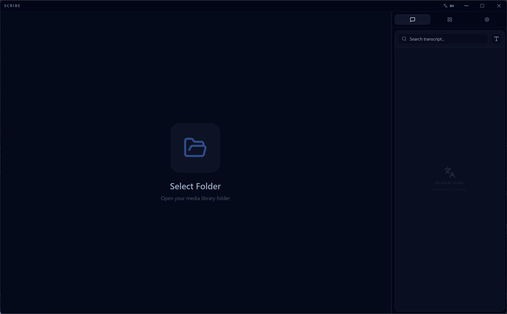
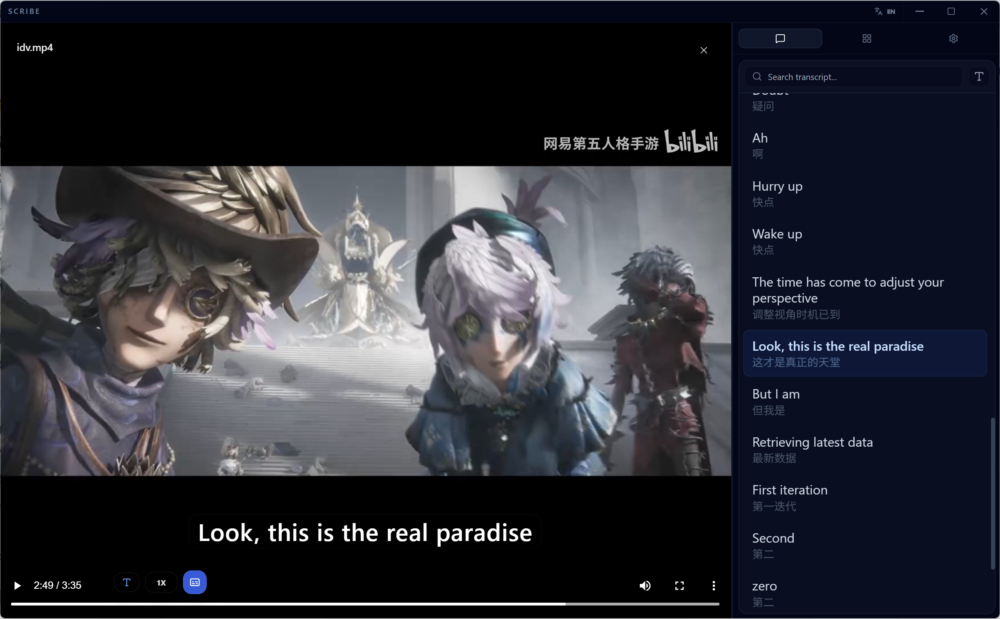

# Scribe Desktop

A high-performance local video player with offline SRT subtitle support, bilingual subtitle display, and integrated file explorer.

Generated by [Google AI Studio](https://aistudio.google.com/)

## Screenshots

## Download

📦 **[Download Scribe Desktop v0.1.0](https://github.com/runlingli/Scribe_desktop_video_player/releases/latest)**

## Features

- **Local Video Playback** - Play videos directly from your local folders
- **SRT Subtitle Support** - Automatic subtitle file matching and loading
- **Bilingual Subtitles** - Display up to two subtitle tracks simultaneously in the sidebar transcript view
- **Smart Subtitle Matching** - Automatically matches subtitle files based on filename patterns (e.g., `video.zh.srt`, `video.en.srt`)
- **File Explorer** - Browse and organize your video library with folder structure support
- **Playback Controls** - Adjust playback speed and subtitle size
- **Customizable Settings** - Configure filename separators and suffix mappings for subtitle detection
- **Drag & Drop** - Easily load folders by dragging and dropping

## Subtitle File Naming

Scribe automatically detects subtitle files that match your video filenames. Supported patterns:

- `video.zh.srt` → Chinese
- `video.en.srt` → English  
- `video.jp.srt` → Japanese
- `video.srt` → Default subtitle

Default separators: `.`, `_`, `-`

You can customize separators and suffix mappings in the Settings panel.

## Interface

- **Video Player** - Main playback area with subtitle overlay
- **Transcript View** - Side-by-side subtitle display for easy reading
- **Explorer View** - File browser to navigate your video library
- **Settings Panel** - Configure subtitle detection and manage tracks

## System Requirements

- Windows 10 or later

---

*Scribe Desktop*

